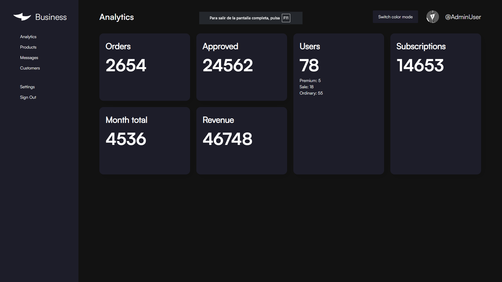

# Admin Dashboard
A practice project focused on mastering CSS Grid and Flexbox layouts. This admin dashboard is designed to help improve layout skills by combining modern CSS techniques. The project features a clean interface for managing data and visualizing analytics, with an emphasis on layout structure rather than production-ready features.

[View the live demo](https://vicker14.github.io/admin-dashboard/)

## Features

- Practice implementation of CSS Grid and Flexbox